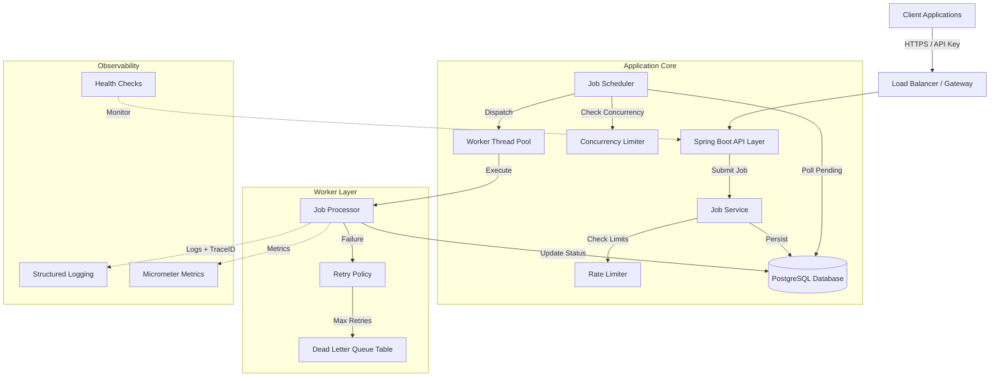
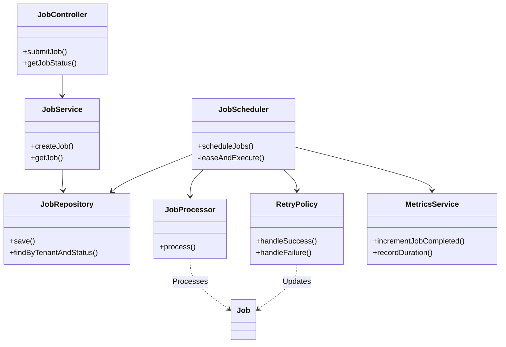
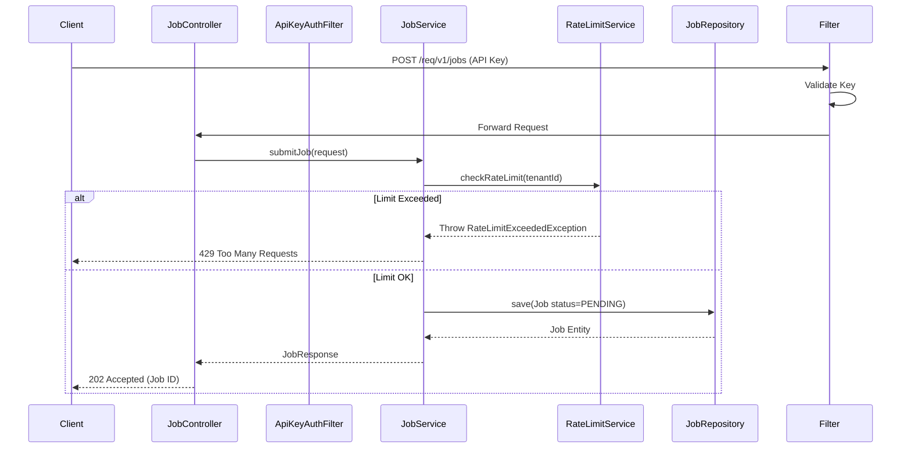
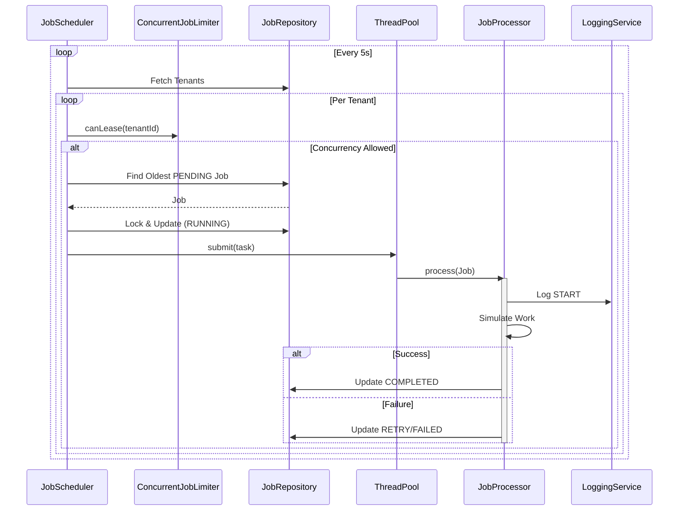

# System Design Document - Nurix Task Queue System

## 1. System Overview
The Nurix Task Queue is a robust, multi-tenant, asynchronous job processing system built with Spring Boot. It provides mechanisms for job submission, rate limiting, concurrency control, reliable execution, and comprehensive observability.

## 2. High-Level Design (HLD)

### Architecture Diagram

### Key Components
1.  **API Layer**: Handles authenticated requests via `ApiKeyAuthFilter`. Validates payloads and enforces rate limits.
2.  **Database (PostgreSQL)**: Serves as the persistent queue. Uses `SKIP LOCKED` (simulated via optimistic locking/status updates) and indexing for efficient polling.
3.  **Scheduler**: A scheduled task that fairly iterates through tenants to fetch pending jobs, ensuring no single tenant starves others.
4.  **Worker Pool**: A managed thread pool (`ThreadPoolTaskExecutor`) that executes jobs asynchronously.
5.  **Observability Stack**: `MDCFilter` for distributed tracing, Micrometer for custom metrics, and JSON structured logging.

---

## 3. Low-Level Design (LLD)

### Class Diagram (Core Components)

### Sequence Diagram: Job Submission

### Sequence Diagram: Job Execution

---

## 4. Design Patterns Implemented

1.  **Repository Pattern**:
    *   **Usage**: `JobRepository`, `TenantRepository`.
    *   **Reason**: Abstraction over the data layer, allowing us to swap the underlying storage technology without changing business logic.

2.  **Strategy Pattern** (Implicit):
    *   **Usage**: The `JobProcessor` acts as a strategy for execution. While currently single-purpose, different processors could be swapped in `JobScheduler` based on job type.

3.  **Decorator Pattern**:
    *   **Usage**: `MdcTaskDecorator` in `AsyncConfig`.
    *   **Reason**: To decorate the worker threads with context (MDC Trace IDs) from the main thread transparently.

4.  **Builder Pattern**:
    *   **Usage**: `@Builder` on entities like `Job`, `Tenant`, `DLQEntry`.
    *   **Reason**: Provides a fluent API for constructing complex objects with multiple optional parameters.

5.  **Singleton Pattern**:
    *   **Usage**: All Spring `@Service` and `@Component` beans (`JobScheduler`, `RateLimitService`).
    *   **Reason**: Efficient memory usage and shared state management for services that don't need per-request instances.

6.  **Filter Chain Pattern**:
    *   **Usage**: `MDCFilter`, `ApiKeyAuthFilter`.
    *   **Reason**: Intercepting requests for cross-cutting concerns (Tracing, Security) before they reach the business logic.

---

## 5. SOLID Principles Analysis

| Principle | Implementation in Project |
| :--- | :--- |
| **S - Single Responsibility** | Classes are highly focused. `JobScheduler` only schedules. `JobProcessor` only executes logic. `MetricsService` only handles metrics. `RetryPolicy` encapsulates retry logic. `LoggingService` manages structured logs. |
| **O - Open/Closed** | `JobScheduler` depends on the `JobProcessor` abstraction. We can add new types of processors or metrics without modifying the scheduler's core loop extensively (with minor refactoring for polymorphism). |
| **L - Liskov Substitution** | Used primarily via Spring's Interface injection (`JobRepository` extends `JpaRepository`). Any implementation of the repository interface can be substituted without breaking the service layer. |
| **I - Interface Segregation** | Interfaces are small and specific. For example, `HealthIndicator` is a specific interface for health checks, distinct from business logic interfaces. |
| **D - Dependency Injection** | We use Constructor Injection (`@RequiredArgsConstructor`) throughout the application. No class manually instantiates its dependencies (e.g., `new JobRepository()`), making the system testable and loosely coupled. |
